# bio-platform

Backend da plataforma de análise de micobioma e transcriptômica — TCC de bioinformática.

Contém: API REST/WebSocket (FastAPI), worker de análise estatística (R/Bioconductor), migrations SQL (PostgreSQL 16) e manifests k3s.

---

## Status de implementação

| Componente | Status | Detalhe |
|---|---|---|
| Migrations SQL (tabelas, índices, views, roles) | ✅ Pronto | Roda automático no `docker compose up` via `initdb.d` |
| Trigger `trg_notify_new_job` | ✅ Pronto | PG notifica o R Worker a cada INSERT com `status='queued'` |
| FastAPI — core, config, pool PG | ✅ Pronto | Lifespan, CORS, `asyncpg` pool |
| FastAPI — router `projects` + repositório PG | ✅ Pronto | CRUD: listar, buscar por ID, criar |
| FastAPI — router `jobs` (list + WebSocket) | 🔧 Parcial | List OK; WS é echo — LISTEN/NOTIFY real pendente |
| FastAPI — router `samples` (presigned upload) | 🔧 Stub | Estrutura criada, lógica MinIO pendente |
| FastAPI — router `analysis` (busca ES) | 🔧 Stub | Endpoints declarados, handlers pendentes |
| R Worker — loop `LISTEN/NOTIFY` + dispatcher | ✅ Pronto | `postgresWaitForNotify` + `FOR UPDATE SKIP LOCKED` |
| R Worker — helpers PG / ES / MinIO | ✅ Pronto | Conexão, bulk insert, download/upload |
| R Worker — `deseq2.R` | 🔧 Parcial | Fluxo principal escrito; requer phyloseq real para teste |
| R Worker — `ancombc.R` / `maaslin2.R` | 🔧 Stub | Esqueleto com chamadas corretas, sem dados reais |
| R Worker — `spieceasi.R` / `random_forest.R` | 🔧 Stub | Idem |
| R Worker — `gsea.R` / `funguild.R` / `picrust2.R` | 🔧 Stub | Idem |
| Infra k3s (manifests por nó) | ✅ Pronto | Deployments, taints, StatefulSets, Ingress |
| Docker Compose (dev local) | ✅ Pronto | PG + ES + MinIO + API (R Worker separado — imagem pesa ~20 min de build) |

> Scripts R são stubs aguardando dados reais de QIIME2/DADA2. A estrutura de chamadas e o contrato de output já estão definidos; preencher é trabalho de análise, não de arquitetura.

---

## Comparativo de desempenho

Estimativa operacional: **workflow manual de R scripts** (pré-plataforma) vs **Bio-Platform** (atual).

```mermaid
%%{init: {"theme": "base"}}%%
xychart-beta
    title "Tempo médio por operação (minutos) — menor é melhor"
    x-axis ["Configurar análise", "Ver resultados", "Recuperar erro", "Setup novo projeto"]
    y-axis "Minutos" 0 --> 65
    bar [50, 20, 35, 60]
    bar [4, 1, 2, 8]
```



*Azul = workflow manual · Laranja = Bio-Platform*

| Métrica | Workflow manual | Bio-Platform | Ganho |
|---|---|---|---|
| Configurar nova análise | ~50 min (editar script, carregar dados) | ~4 min (POST via API) | **12×** |
| Ver resultados | ~20 min (ler CSV, montar tabela) | ~1 min (dashboard / ES search) | **20×** |
| Recuperar de erro | ~35 min (reler log, re-rodar manualmente) | ~2 min (log no PG, retry automático) | **17×** |
| Setup novo projeto | ~60 min (estrutura, scripts, paths) | ~8 min (POST + upload FASTQ) | **7×** |
| Análises simultâneas | 1 (bloqueante no desktop) | 8+ (fila PG, nó dedicado k3s) | **8×** |
| Rastreabilidade | Nenhuma (arquivos locais, sem histórico) | Total (PG + ES + MinIO) | — |
| Acesso remoto | Não | Sim (k3s ingress) | — |

---

## Contexto científico

Três projetos de análise rodando na mesma plataforma:

| Projeto | Marcador | Análise principal | Método |
|---------|----------|-------------------|--------|
| **INOVAHERB** | ITS | Micobioma fatorial | ANCOM-BC2 |
| **Pós-Fogo** | 16S | Série temporal de recuperação de solo | MaAsLin2 |
| **Biorremediação** | ITS + 16S | Correlação com bário (BaCl₂/BaSO₄) + *Typha domingensis* | DESeq2 + SpiecEasi |

O objetivo final do TCC é um painel de **6 PCoAs** (2 por projeto) gerado quando os 3 projetos concluem — evento `CrossProjectFigureReady`.

---

## Stack

| Camada | Tecnologia |
|--------|-----------|
| API | FastAPI (async) + asyncpg |
| Fila de jobs | PostgreSQL LISTEN/NOTIFY + `FOR UPDATE SKIP LOCKED` |
| Computação | R 4.4 + Bioconductor (DESeq2, ANCOM-BC2, MaAsLin2, SpiecEasi) |
| Banco | PostgreSQL 16 (source of truth) |
| Busca | Elasticsearch 8 (leitura, indexado após PG confirmar `done`) |
| Blobs | MinIO S3-compat (FASTQ, phyloseq .rds, modelos RF) |
| Infra | k3s (5 nós AMD) |

**Sem Redis** — a fila é inteiramente via PG.

---

## Rodar localmente

```bash
cp .env.example .env
docker compose up -d
```

A API sobe em `http://localhost:8000`. Docs interativos em `/docs`.

Primeira vez — as migrations rodam automaticamente via `docker-entrypoint-initdb.d`:

```
db/migrations/001_init.sql        → tabelas base (projects, samples)
db/migrations/002_jobs_queue.sql  → fila + trigger NOTIFY + analysis_results
db/migrations/003_views_roles.sql → views analíticas + roles PG
```

---

## Estrutura de pastas

```
bio-platform/
├── api/
│   └── app/
│       ├── core/           → config, pool PG, cliente ES, cliente MinIO
│       ├── domain/         → entidades e VOs por Bounded Context
│       │   ├── shared/     → MarkerType, ProjectCode, AnalysisId
│       │   ├── sample/     → Project, Sample, SampleParser, TreatmentGroup
│       │   ├── pipeline/   → PipelineJob, MarkerConfig
│       │   └── analysis/   → AnalysisJob, AnalysisType
│       ├── infrastructure/
│       │   ├── adapters/   → ACL: QiimeAdapter, RBioconductorAdapter
│       │   └── repositories/ → PgProjectRepository, PgJobRepository
│       └── api/v1/         → routers FastAPI
├── r-worker/
│   ├── worker.R            → loop LISTEN/NOTIFY
│   ├── analyses/           → um arquivo .R por tipo de análise
│   └── utils/              → pg_helpers.R, es_helpers.R, minio_helpers.R
├── db/migrations/
└── infra/manifests/        → deployments k3s por nó
```

---

## Fluxo principal

```
Upload FASTQ (presigned URL → MinIO)
    ↓
POST /api/v1/projects/{id}/pipeline   →  PipelineJob criado (status: queued)
    ↓
trg_notify_new_job  →  pg_notify('new_job', job_id)
    ↓
R Worker acorda  →  FOR UPDATE SKIP LOCKED
    ↓
Análise roda (DESeq2 / ANCOMBC2 / MaAsLin2 / SpiecEasi / ...)
    ↓
Resultado salvo:
  ├── PostgreSQL  →  analysis_results (JSONB)
  ├── Elasticsearch  →  bulk index em batches de 1000
  └── MinIO  →  modelos RF (.rds), artefatos grandes
    ↓
[quando os 3 projetos concluem]  →  CrossProjectFigureReady
```

O R Worker **nunca gera figuras** — output é sempre dado estruturado (CSV → PG, JSON → ES). Visualizações ficam no [bio-frontend](../bio-frontend).

---

## Anti-Corruption Layer (ACL)

Nomes de bibliotecas externas **não aparecem fora dos adapters**:

| Adapter | Traduz |
|---------|--------|
| `QiimeAdapter` | vocabulário QIIME2 → domínio |
| `RBioconductorAdapter` | `phyloseq`, `DESeqDataSet`, `SpiecEasi` → domínio |

---

## Endpoints principais

| Método | Rota | O que faz |
|--------|------|-----------|
| GET | `/api/v1/projects/` | Lista projetos |
| POST | `/api/v1/projects/` | Cria projeto |
| POST | `/api/v1/samples/presigned-upload` | Gera URL para upload de FASTQ |
| GET | `/api/v1/jobs/{project_id}` | Lista jobs do projeto |
| WS | `/api/v1/jobs/ws/status` | Status em tempo real |
| GET | `/api/v1/analysis/{job_id}/results` | Resultados de uma análise |
| GET | `/api/v1/analysis/search/degs?q=` | Busca genes (Elasticsearch) |

---

## Adicionar um novo tipo de análise

1. Criar `r-worker/analyses/minha_analise.R` com função `run_minha_analise(payload, con)`
2. Registrar no `switch` em `r-worker/worker.R`
3. Adicionar o valor em `AnalysisType` em `api/app/domain/analysis/entities.py`
4. Output deve ser sempre JSON serializável — nunca `ggplot2`, nunca `ggsave`

---

## Deploy k3s

Cada serviço tem afinidade de nó configurada nos manifests:

| Nó | Serviço |
|----|---------|
| `agent-1` | R Worker (taint `only-r-worker`) |
| `agent-2` | API FastAPI |
| `agent-4` | PostgreSQL, MinIO |

```bash
kubectl apply -f infra/manifests/
```

Timeout do Nginx Ingress configurado para 30 min (SpiecEasi pode levar 20 min).

---

## Variáveis de ambiente

Ver `.env.example`. As principais:

```
POSTGRES_HOST / POSTGRES_DB / POSTGRES_USER / POSTGRES_PASSWORD
ES_HOST
MINIO_ENDPOINT / MINIO_ACCESS_KEY / MINIO_SECRET_KEY
```

Em k3s, usar um Secret `bio-platform-secrets` referenciado nos deployments.
